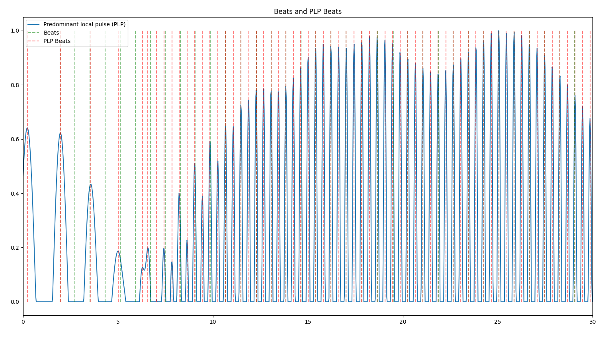

# ARL project

## Title - Drone movement synchronization based on music

### Authors
- Joanna Wałowska
- Krzysztof Nowicki
- Tomasz Kaproń

### Project purpose
The purpose of this project was to make drone dance to any music. It was supposed to generate random trajectories built from music parameters, that are suitable for drone flight. Music mp3 files are processed, and properties are extracted. Knowing the values of those parameters makes it possible to be used for precise trajectory creation. 

After the trajectory gets generated it is sent directly to drone instance. Drone uses position control, optimised with optitrack solution.

Repository is also responsible for music playing and synchronizing with the drone itself.


### Generating trajectory details
The trajectory is generated using the librosa library. Initially, a long list of basic trajectory sequences is generated using only the x and y coordinates. Among the basic trajectories are various geometric shapes such as rectangles, circles, eights, and segments of sine waves.  The sequence of basic trajectories is always random, but the same figure cannot appear next to each other. Next, the times when the beats will appear are extracted. Then, using the predominant local pulse (PLP), the third coordinate - z, is extracted. In this case, these values will always be the same for the same song. The final step is to combine the x, y, z coordinates and the times when the next bit occurs. The merging is based on checking the distance between the basic trajectories, if they are too far apart, a point in the trajectory that is in a given range is searched for, and the trajectory is then connected using this point.

- Music processing visualization (30 seconds of song)


- Example generated trajectory (60 seconds of song)


### Dependencies
- [UDP_republisher](https://github.com/Kwach00/UDP_to_ROS2_OptiTrack_republisher)
- [rocker](https://github.com/osrf/rocker)
  - We use `rocker` to enable GUI applications such as `rviz` and `rqt` on Docker Containers.
  - Refer to [here](http://wiki.ros.org/docker/Tutorials/GUI) for more details.

## Installation with Docker

Download repository
```
git clone https://github.com/panchasan/ARL_project.git
```

Build docker image from delivered Dockerfile

```
cd ARL_project/
docker build --pull --no-cache --tag tello_ros:foxy .
```

Run container with delivered script `run.sh`
```
cd drone_ws
./proj_container/run.sh
```

Install dependencies & build workspace
```
cd drone_ws
sudo apt-get update
rosdep update
vcs import src < drone.repos
rosdep install --from-paths src --ignore-src -yr
colcon build --symlink-install --cmake-args -DCMAKE_BUILD_TYPE=Debug -DCMAKE_EXPORT_COMPILE_COMMANDS=1
source install/setup.bash
```

## Configuring the container

Every time the container is started with `run.sh` script, it should be followed by `setup.sh` script. The terminal where the script was run will not have full functionality. Enter the container from the other terminal with `enter.sh` script. It will look as follows:
```
(foxy) user@machine:~/drone_ws (master #%)$
```
## Generate the trajectory
```
python3 generate_trajectory.py <absolute path to .ogg file>
```

## Running the demo in Gazebo
First terminal:
```
source install/setup.bash
ros2 launch tello_gazebo simple
```
Second terminal:
```
source install/setup.bash
ros2 run pkg_g2rr g2rr tello_1
```
Third terminal:
```
source install/setup.bash
ros2 run tello_python_driver control
```

## Running on actual drone unit
First thing to consider is the connection with working optitrack setup. After this is done it could get connected with UDP republisher(Optitrack)
```
ros2 run udp_republisher udp_republisher $DRONE_NAME
```
Next step is to get connected with drone. In case of DJI Tello:
```
ros2 launch tello_driver teleop_launch.py
```
Tello takeoff:
```
ros2 service call /tello_action tello_msgs/TelloAction "{cmd: 'takeoff'}"
```
Make the drone dance:
```
ros2 run tello_python_driver lab_test
```

Tello land:
```
ros2 service call /tello_action tello_msgs/TelloAction "{cmd: 'land'}"
```

### Functionalities Delivered
- loading music files
- extracting the essential features from music
- generating trajectory based on specific musisc features
- connecting with drone instance
- position control using Optitrack
- connecting to real flying unit (DJI Tello)
- synchronizing drone with music
- making the drone dance

### undelivered
- synchronizing more then one fliyng unit

## Requrements
librosa 0.9.2
python 3.8
asyncio
google
google-api-python-client
protobuf 3.20.3
transformations 2018.9.5
